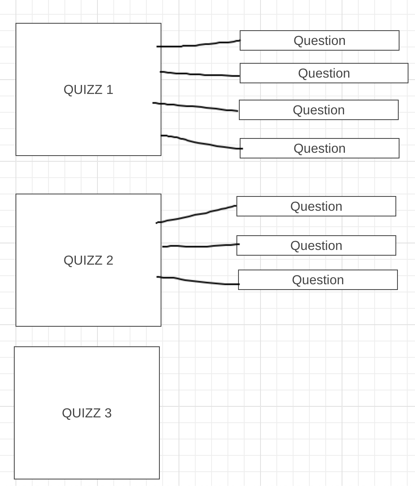
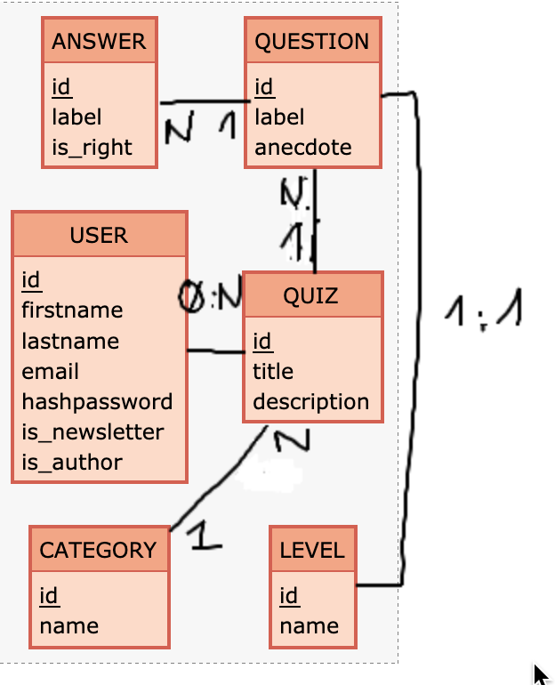

# MCD de la base de données oQuizz

Pour chaque table de notre base de données, nous aurons toujours 3 champs de base :
- id : qui est l'identifiant unique des enregistrements de notre table
- created_at : qui est la date de création de l'enregistrement
- updated_at : la dernière date de modification de l'enregistrement

## tables 

### app_users

- id INT
- firstname TEXT
- lastname TEXT
- email TEXT
- password TEXT
- status INT
- created_at DATE
- updated_at DATE

### quizzes

- id INT
- title TEXT
- description TEXT
- status INT
- created_at DATE
- updated_at DATE

### questions

- id INT
- label TEXT
- anecdote TEXT
- wiki TEXT
- status INT
- created_at DATE
- updated_at DATE

### answer

- id INT
- description TEXT
- status INT
- created_at DATE
- updated_at DATE

### level

- id INT
- name TEXT
- status INT
- created_at DATE
- updated_at DATE

### tag

- id INT
- name TEXT
- status INT
- created_at DATE
- updated_at DATE

# Explication liaison 0:N

1 has 1
1 has N
N has N
0 has N

En cas de 1 has N (1:N) -> quiz 1 et quiz 2
En cas de 0 has N (0:N) => quiz 1, quiz 2, quiz 3

Pourquoi car quiz 3 n'as aucune questions liés et ne peut donc pas être sélectionné dans la jointure.

## liaisons tables

